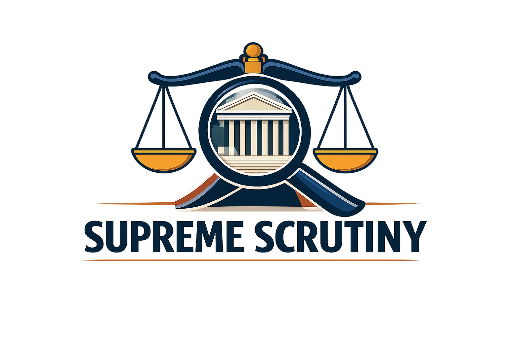

  

# Supreme Scrutiny

An interactive web application for exploring the full history of the United States Supreme Court — its cases, justices, voting patterns, legal topics, and predicted outcomes — powered entirely by the free [Oyez API](https://api.oyez.org).

Whether you are a student, a legal researcher, a journalist, or simply a curious citizen, this tool lets you dig into more than two centuries of Supreme Court history without needing any technical background.

---

## Table of Contents

1. [Overview](#overview)
2. [Branch Updates](#branch-updates)
3. [Home — Case Explorer](#home--case-explorer)
4. [Cases](#cases)
5. [People — Justices & Advocates](#people--justices--advocates)
6. [Analysis](#analysis)
7. [History](#history)
8. [Legal Topics](#legal-topics)
9. [Insights — Presidential Legacy & Predictions](#insights--presidential-legacy--predictions)
10. [Data Source](#data-source)
11. [Running the App](#running-the-app)
12. [Oyez API Data Dictionary](docs/oyez_api_data_dictionary.md)

---

## Overview

SCOTUS Case Visualizer brings together a broad range of interactive tools in a single application. You can trace how an individual case traveled through the courts, study a justice's voting record across decades, compare how different presidential administrations shaped the bench, explore constitutional amendments and the landmark cases that define them, or even ask the app to predict how a hypothetical new case might be decided.

All data is served from local Oyez caches and parquet snapshots — the app still uses Oyez as the source, but pages now read from local data files whenever possible to reduce live API dependence and improve load performance.

## Branch Updates

This branch adds a major offline-first migration and a host of reliability and analysis improvements:

- Migrated all page-level case and detail loading to `utils/oyez_api.py` / local parquet data, removing direct runtime `requests.get(...)` and `time.sleep(...)` from app pages.
- Added support for local cached data and new prebuilt assets: `data_files/current_justices.json`, `data_files/date_index.json`, `data_files/circuit_reversal_rates.json`, `data_files/changelog.json`, `data_files/advocate_stats.parquet`, and `data_files/circuit_stats.parquet`.
- Added new utility modules for CSV export, TF-IDF case search, today-in-history lookup, transcript parsing, background batch loading, and optional CourtListener integration.
- Added build scripts for the date index and circuit reversal rates: `scripts/build_date_index.py` and `scripts/build_circuit_reversal_rates.py`.
- Added test coverage under `tests/` for data files, local helpers, Oyez API wrappers, text search, and ML predictor utilities.
- Removed the duplicate `pages/Insights.py` page and simplified `pages/History.py` so Court History no longer duplicates Circuit Courts and Historical Data tabs.
- Updated the home and navigation flow to be more reliable, with local-first caching and fewer live network dependencies.

**Key new tools in this branch:**

- `utils/export.py` — reusable DataFrame CSV download button
- `utils/text_search.py` — TF-IDF based semantic case search
- `utils/today_in_history.py` — Today in SCOTUS History widget support
- `utils/transcript_parser.py` — oral argument transcript extraction and parsing
- `utils/background_loader.py` — parallel cached detail loading
- `utils/courtlistener_api.py` — optional CourtListener / Free Law Project integration

**Page-level changes:**

- Updated the `cases.py`, `pages/1_Cases.py`, `pages/2_Justices.py`, `pages/3_Court_History.py`, `pages/4_Analytics.py`, `pages/5_Circuit_Courts.py`, `pages/6_Legal_Topics.py`, `pages/8_Presidential_Legacy.py`, `pages/9_Predictions.py`, `pages/10_Research.py`, `pages/11_Advocates.py`, `pages/12_Geography.py`, `pages/13_Historical_Data.py`, `pages/Analysis.py`, `pages/History.py`, `pages/People.py`, and `pages/Topics.py` pages to use local cached data flows.
- Removed the old Insights duplicate page and cleaned up navigation so each section is unique.

**Why it matters:**

This branch makes the app much more stable and responsive by serving data from local caches and precomputed snapshots, while preserving the underlying Oyez data source and enabling richer offline analytics.

**Main sections of the app:**

| Section | What it covers |
|---|---|
| **Home** | Instant lookup of any case by term; journey diagram and vote breakdown |
| **Cases** | Search, timeline browsing, oral argument transcripts, and a full term calendar |
| **People** | Justice career histories, voting patterns, agreement matrices, and advocate win rates |
| **Analysis** | Analytics across terms, close decisions, win-rate comparisons, and geographic maps |
| **History** | Court composition over time, confirmation votes, and Chief Justice eras |
| **Legal Topics** | Browse by issue area, track constitutional amendments, and read landmark cases |
| **Insights** | Presidential legacy scoring and ML-powered outcome predictions |

[↑ Back to top](#table-of-contents)

---

## Home — Case Explorer

The home page is the quickest way to look up a single case. A dropdown on the left lets you pick any Supreme Court term from the past 25 years; a second dropdown then lists every case argued that term by name.

Once you select a case, the page fills in:

- **Background & Facts** — a plain-language summary of what the case was about and how it arose.
- **Legal Question** — the specific constitutional or statutory question the Court was asked to answer.
- **Metadata** — docket number, the dates it was argued and decided, and the name of the court that delivered the final opinion.

**Visualizations:**

- **Court Journey Diagram** — a color-coded flowchart showing every court that touched the case, from the originating trial or administrative body all the way to the Supreme Court. Courts are shaded by level: blue for lower courts, orange for appellate courts, and red for SCOTUS itself. Hovering over each node shows the court's name and any recorded decision at that stage.
- **Justice Votes** — a horizontal bar chart listing all nine justices and how each one voted: majority, concurrence, dissent, or recusal. Below the chart, the justices are grouped into labeled columns for easy reading.

[↑ Back to top](#table-of-contents)

---

## Cases

The Cases section expands the single-case lookup into a full research toolkit with four tabs.

### Search Cases

A free-text search box lets you type any part of a case name. The app queries all cases from 2000 to the present and returns matching results in a dropdown. Selecting a case shows the same rich detail panel as the home page — background, legal question, metadata, court journey diagram, and justice votes.

### Timeline Browser

Choose a start term and an end term, then click **Load Timeline**. The app retrieves every case in that range and presents:

- A **decision-trend bar chart** showing how many cases were decided each term.
- An **issue-area bar chart** counting how many cases fell into each legal domain across the period.
- A **filterable case table** where you can narrow results by issue area using a multiselect filter.

### Oral Arguments Browser

Browse the oral argument record for any term. A text filter lets you type part of a case name to narrow the dropdown quickly. Selecting a case shows:

- The legal question and key metadata.
- A list of every oral argument session for that case. Each session is an expandable panel showing the total duration, a transcript preview (the first several speaker turns), and a direct link to listen to the full audio on [Oyez.org](https://www.oyez.org).

### Term Calendar

Pick any of the last ten terms to see the full docket treated as a calendar. Five headline numbers at the top give you an instant snapshot: total cases, decided, argued but pending a decision, scheduled for argument, and granted but not yet argued.

The calendar content is then broken into four views:

- **Timeline** — a scatter plot of cases plotted by date and status, plus a Gantt chart showing how long each case spent between oral argument and decision.
- **Monthly View** — month-by-month accordion sections listing each case with its status icon and vote split.
- **Full Docket** — a searchable and filterable list where every case expands to show its docket number, issue area, key dates, disposition, vote, and a link to Oyez.org.
- **Issue Areas** — a stacked bar chart breaking down the status of cases within each legal domain.

[↑ Back to top](#table-of-contents)

---

## People — Justices & Advocates

The People section is organized into two top-level tabs: one focused on the justices themselves, and one on the attorneys who argue before them.

### Justices

**Voting Patterns** lets you pick any term and any case within it to see the justice vote breakdown in chart and list form.

**Justice Career** gives you a deep dive into any individual justice in the Oyez database. After selecting a name, you see:

- A timeline of their judicial roles and years of service.
- An expandable biography.
- A quick-info panel with their appointing president and party.
- A **Voting History** loader — choose up to ten terms and click a button to pull live data. This produces headline metrics (total votes, majority rate, dissent rate), a vote-type breakdown chart, a donut chart of cases by issue area, a dissent-rate-by-term bar, a full table of every dissenting vote, and an expandable complete voting record.

**Agreement Matrix** lets you pick multiple terms and a minimum threshold for shared cases, then generates a color heatmap of pairwise justice agreement percentages. Tables list the ten most- and least-aligned pairs, a voting bloc detector identifies clusters of justices who vote together at a configurable threshold, and an average-agreement bar chart shows which justices are most and least independent.

### Advocates & Arguments

**Advocate Win Rates** loads data for selected terms and shows which attorneys appearing before the Court win the most. A leaderboard tab has a stacked wins/losses bar chart and a color-gradient table. Drilldown tabs show win rates by issue area and a career tracker for individual advocates.

**Amicus Brief Tracker** presents a curated table of major advocacy organizations — the Solicitor General, the ACLU, the Chamber of Commerce, the NAACP Legal Defense Fund, the NRA, the Cato Institute, and others — with their historical filing volumes and win rates, alongside a table of notable cases in which each participated.

**Oral Argument Analytics** summarizes research on how the number of questions a justice asks each side during oral argument predicts their eventual vote, along with typical question counts per sitting justice.

[↑ Back to top](#table-of-contents)

---

## Analysis

The Analysis section is split into two broad areas: court-wide analytics and a geographic view.

### Analytics

**Term Statistics** — pick any of the last 20 terms to see the total case count, a horizontal bar chart of cases by issue area, a donut chart of how decisions broke down by type, and a filterable case listing.

**Close Decisions** — select multiple terms and filter by vote split (5–4, 6–3, 7–2, or all). The results include:

- A donut chart showing the proportion of each split type.
- A stacked bar chart of close-decision trends across terms.
- A **case browser** where each close decision is expandable; majority and dissenting justices are color-coded by ideological lean.
- A **Deciding Vote** analysis (for 5–4 cases) showing how often each justice was in the majority versus the dissent on the Court's most contested decisions.
- A breakdown of close decisions by issue area.

**Win Rates** — load data for selected terms and explore which kinds of parties win at the Supreme Court:

- *Overall Win Rates* — Federal Government, State/Local Government, Corporations, and Individuals, shown as color-coded cards and a bar chart.
- *Head-to-Head* — pick two party types and see how they fare when matched directly against each other, with sample cases.
- *Trend Over Time* — a line chart of win rates per term for any selected party type.
- *By Issue Area* — a bar chart of win rates per legal domain for a selected party.
- *Solicitor General* — a dedicated view of the federal government's win rate over time, with headline metrics on its strongest issue areas.

**SCOTUS vs. Congress** — a curated dataset of roughly 26 landmark cases from 1803 to 2024 in which the Court struck down a federal or state law. Filters let you narrow by era, issue area, and constitutional basis. Four sub-views show a timeline scatter plot, a bar chart of which constitutional grounds were invoked most often, a count of laws struck per Chief Justice era, and a full annotated table.

### Geography

**State Impact Map** — select terms and a metric (cases reviewed, reversal rate, or affirmance rate), then click to build a shaded choropleth map of the United States. Horizontal bar charts highlight the states most frequently reviewed and those facing the highest reversal rates. A state drilldown lets you explore case-level details for any individual state.

**Term Comparator** — pick any two terms from 1994 to the present and compare them side by side. A radar chart overlays both terms across eight dimensions (case volume, vote margin, issue distribution, etc.), and grouped bar charts break down issue areas, vote splits, and case lists for each.

**Citation Explorer** — explore how Supreme Court decisions reference earlier decisions, tracing the network of citations across cases.

[↑ Back to top](#table-of-contents)

---

## History

The History section covers the Court as an institution — who has served, when, and how the bench has changed over time.

### Court Composition

**Service Timeline** — a horizontal Gantt chart spanning 1937 to the present, with one bar per justice. Color can be toggled between ideological lean (blue, green, red for Liberal, Moderate, Conservative) and appointing president. Currently serving justices are highlighted with a gold border. Shaded bands mark each Chief Justice era.

**Court Snapshot** — a year slider lets you step through any year since 1953 to see exactly who was on the bench, how the Court was divided ideologically, and which presidents appointed the sitting justices.

**Ideological Balance** — a stacked area chart showing how the count of Liberal, Moderate, and Conservative justices has shifted year by year since 1953, with vertical markers at each new Chief Justice transition.

### Chief Justice Eras

Select one or more of the four major eras — Warren, Burger, Rehnquist, and Roberts — and load their data. Results include total cases per era, issue-area share, disposition breakdown, a case-volume-over-time line chart, and expandable per-era case data.

### Confirmation Timeline

A detailed view of every Supreme Court confirmation vote since 1949, presented across five sub-views:

- **Timeline** — scatter plot of all nominations; dot size scales with the yes-vote count; gold stars mark seats where the new justice shifted the Court's ideological balance.
- **Vote Margins** — tables of the most and least unanimous confirmations, a stacked yes/no vote bar per nominee, and a trend line of confirmation yes-percentages over time.
- **Days to Confirm** — bar chart and metrics for nomination-to-confirmation speed, plus a scatter plot of confirmation time versus controversy score.
- **Seat Shifts** — a color-coded list of confirmations that changed the Court's balance, showing the before-and-after ideology for each seat and a running ideological balance chart.
- **Justice Cards** — a filterable card grid (by party, lean, and seat type) showing confirmation details for every justice.

### Full Historical Timeline

A "Load Live Oyez Data" panel lets you augment pre-1953 historical records with live figures from selected terms. Five radio-button views cover the full 1790–present span:

- **Full Timeline** — a filled line chart of any metric (cases argued, decided, reversed, affirmed, reversal rate) from 1790 to today, with Chief Justice era shading, landmark case annotations, a 10-year rolling average overlay, and a source-coloring toggle distinguishing historical from live data.
- **Outcomes** — reversal and affirmance trend charts over the full historical period.
- **Era Comparison** — side-by-side statistics for each Chief Justice era.
- **Milestones** — an annotated timeline of historically significant decisions and events.
- **Term Drilldown** — select any single term for a detailed view of its cases and statistics.

[↑ Back to top](#table-of-contents)

---

## Legal Topics

The Legal Topics section makes it easy to explore the Court's record through the lens of a specific area of law or constitutional provision.

### Issue Area Decisions

Choose one of 14 legal issue areas (Criminal Procedure, Civil Rights, First Amendment, Due Process, Privacy, Economics, Federalism, and others), set a term range, and click **Load Decisions**. The results include a pie chart of decision types, a bar chart of cases per term, a filterable case list, and a drilldown for any individual case showing the legal question, background facts, and the full majority/dissent breakdown.

### Amendments Tracker

A dropdown of 11 constitutional provisions — First Amendment Speech and Religion, Second Amendment, Fourth Amendment, Fifth Amendment, Sixth Amendment, Eighth Amendment, Fourteenth Amendment, Commerce Clause, Executive Power, and Voting Rights. Selecting one displays:

- A plain-language summary of how the Court has interpreted that provision.
- A horizontal dot timeline of landmark cases.
- An expandable list of key decisions with their holding text, year, and a button to load the full Oyez record live.

### Constitutional Provisions

A dropdown of eight major legal doctrines (Commerce Clause, Free Speech, Privacy/Abortion, Equal Protection, Administrative Law, Second Amendment, Criminal Procedure, Voting Rights, Separation of Powers). Each entry shows a description of the doctrine's evolution, a milestone timeline chart where green dots indicate expansions of the doctrine and red dots indicate contractions, and a curated table of notable Congressional responses to Supreme Court decisions.

### Landmark Cases

A browser of recent landmark decisions — including *Dobbs v. Jackson*, *NYSRPA v. Bruen*, *SFFA v. Harvard*, *Loper Bright Enterprises v. Raimondo*, and *Trump v. United States* — with the full majority/dissent lineup, issue area, and an outcome summary for each.

[↑ Back to top](#table-of-contents)

---

## Insights — Presidential Legacy & Predictions

The Insights section combines historical analysis with machine-learning-based forecasting.

### Presidential Legacy

**Overview** — a Gantt chart of all justices color-coded by ideology, party, or appointing president, with presidential tenure bands. Summary charts show appointee counts and average tenure per president.

**Cohort Analysis** — select one or more presidents, choose terms, and load voting data to compare how each president's appointees have voted: majority rates, dissent rates, and per-justice breakdowns within each cohort.

**Influence by Issue Area** — a stacked bar chart of majority opinions by issue area colored by presidential cohort. A heatmap shows the majority rate per president per legal domain. A bipartisan section highlights cases where appointees from opposing parties voted together.

**Voting Blocs** — an inter-justice agreement heatmap and tables of the most- and least-aligned cross-cohort justice pairs.

**Legacy Score** — a composite score for each president based on service years contributed by their appointees, appointee count, ideological cohesion, currently serving justices, and historical era. A bar chart displays scores per president colored by party, a stacked breakdown shows score components, and an **Ideological Shift Map** shows each president's net directional impact on the Court.

### Predictions

**Case Outcome Predictor** — fill out a short form describing a hypothetical case: circuit of origin, issue area, petitioner type, whether the Solicitor General is supporting the petition, whether there is a circuit split, and the current count of conservative justices. Clicking **Generate Prediction** produces:

- A colored verdict banner (Likely Reversed, Lean Reverse, Toss-Up, Lean Affirm, or Likely Affirmed).
- A gauge chart showing the reversal probability as a percentage.
- A bar chart of the most likely vote splits (9–0 through 5–4).
- A factor summary panel with progress bars showing how much each input is contributing to the prediction.
- Nine per-justice probability cards showing whether each justice is predicted to be in the majority or dissent.
- A court bench diagram — nine circles arranged as a bench, sized by probability, with filled circles for predicted majority votes and an ✕ for predicted dissents.
- A historical context chart showing the actual reversal rate for every circuit.

**Model Performance** — once the model has been trained, four metrics are displayed: cross-validation accuracy, hold-out accuracy, vote-split accuracy, and the number of cases used for training.

**Model Training** — an interface to download the latest Oyez training data and fit the model, with a live progress indicator.

**Cert Grant Predictor** — a companion form that estimates the probability a case will be granted certiorari based on circuit, issue area, and related factors.

**Docket Watch** — a live view of the current term's docket with ML-generated reversal probabilities for each pending case and an issue-area bar chart for the full term.

[↑ Back to top](#table-of-contents)

---

## Data Source

All data comes from the **[Oyez API](https://api.oyez.org)** — a free, publicly available API maintained by Cornell's Legal Information Institute in partnership with Oyez.org. It covers Supreme Court cases from 1792 onward and includes:

- Full case metadata (docket numbers, dates, lower court information)
- Justice votes on every recorded decision
- Oral argument audio links and transcripts
- Case backgrounds, facts, and legal questions
- Decisions and their winning parties

No API key or account is required. The app caches responses locally so that previously loaded cases load instantly on repeat visits.

[↑ Back to top](#table-of-contents)
